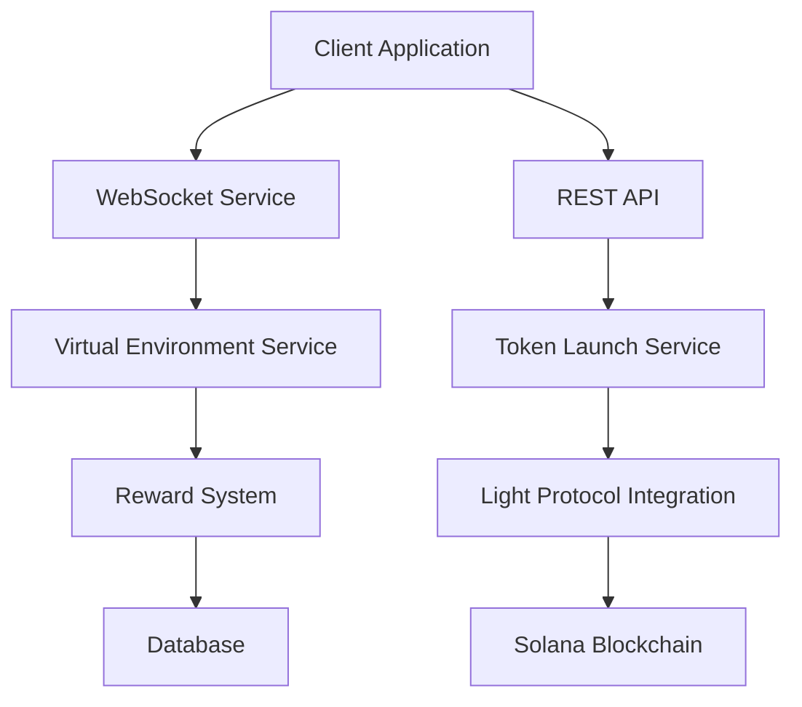
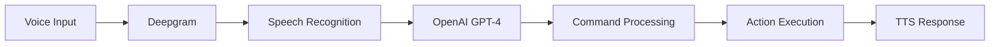

# Technical Architecture

## Overview

FunPump's architecture is designed around real-time communication, scalability, and a seamless user experience. The platform integrates several key technologies:



## Core Components

### Client Layer

#### React/TypeScript Frontend
- Modern component architecture
- Real-time WebSocket integration
- Voice command processing
- Interactive visualizations

```typescript
// Example WebSocket Hook Usage
const { isConnected, sendMessage } = useWebSocket({
  reconnectAttempts: 5,
  reconnectInterval: 3000,
  heartbeatInterval: 30000
});
```

### Communication Layer

#### WebSocket Service
- Real-time price updates
- Live chat functionality
- Virtual environment state management
- Automatic reconnection handling

```typescript
// Example Message Structure
interface WebSocketMessage {
  type: 'VIRTUAL_TRADE' | 'CHAT_MESSAGE' | 'PRICE_UPDATE';
  data: {
    environmentId?: string;
    amount?: string;
    message?: string;
    // ... other fields
  };
}
```

### Service Layer

#### Virtual Environment Service
- Token simulation
- Price impact calculation
- User interaction management
- Real-time state updates

#### Token Launch Service
- Standard token creation
- Compressed token management
- Bonding curve initialization
- Market making logic

### Blockchain Integration

#### Light Protocol Integration
- Compressed token creation
- Merkle tree management
- Transaction optimization
- State compression

```typescript
// Example Compressed Token Creation
const compressedToken = await compressedTokenService.createCompressedToken(
  creator,
  {
    name: "Test Token",
    symbol: "TEST",
    uri: "https://...",
    maxSupply: 1000000n,
    decimals: 9,
    merkleTree: merkleTreePubkey
  },
  initialBuyAmount
);
```

## Data Flow

### Token Launch Flow
1. User initiates launch (UI/Voice)
2. Parameters validated
3. Virtual environment created (if requested)
4. Token created (standard/compressed)
5. Initial liquidity added
6. Real-time updates begin

### Virtual Trading Flow
1. User joins environment
2. WebSocket connection established
3. Initial state synchronized
4. Real-time updates streamed
5. Trades simulated
6. State updates broadcast

### Reward Distribution Flow
1. User action tracked
2. Points calculated
3. Tier status updated
4. Rewards accumulated
5. Claim transaction created
6. Balance updated

## Testing Infrastructure

Based on our comprehensive testing approach:

### Test Environments
1. Simple Mock Test
   - Quick verification
   - No blockchain connection
   - Rapid development testing

2. Devnet Test Mode
   - Random keypair generation
   - Real transaction testing
   - Network interaction verification

3. Production Testing
   - Mainnet deployment checks
   - Performance monitoring
   - Security validation

## Voice Integration Architecture



### Voice Processing Flow
1. Audio capture
2. Real-time transcription
3. Intent recognition
4. Command validation
5. Action execution
6. Voice feedback

## Security Considerations

### Transaction Security
- Multi-signature support
- Transaction simulation
- Rate limiting
- Slippage protection

### Environment Security
- Isolated virtual environments
- Secure WebSocket connections
- Rate-limited API endpoints
- Input validation

### User Security
- Wallet connection validation
- Permission management
- Activity monitoring
- Anti-bot measures

## Monitoring and Maintenance

### Performance Monitoring
- WebSocket connection health
- Transaction success rates
- API response times
- System resource usage

### Error Handling
- Automatic retry logic
- Fallback mechanisms
- Error reporting
- User notifications

### System Updates
- Zero-downtime deployments
- Backward compatibility
- State migration
- Version management

## Future Scalability

### Planned Improvements
1. Horizontal scaling of WebSocket servers
2. Enhanced compression techniques
3. Layer 2 integration
4. Cross-chain support

### Performance Optimizations
1. WebSocket message batching
2. State caching improvements
3. Transaction bundling
4. Merkle tree optimization
